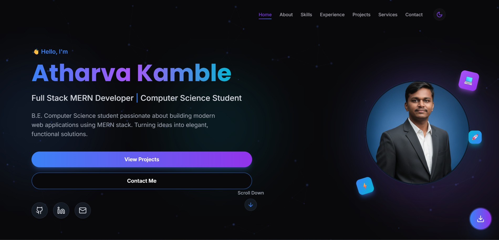

# Atharva Kamble - Portfolio Website

A modern, responsive portfolio website built with React, TypeScript, and Tailwind CSS featuring stunning glassmorphism design, animated particle backgrounds, and smooth scroll animations.



## ✨ Features

- **Glassmorphism Design** - Beautiful frosted glass UI elements with blur effects
- **Animated Particle Background** - Interactive canvas-based particle system
- **Dark/Light Mode** - System preference detection with smooth theme transitions
- **Smooth Scroll Animations** - Framer Motion powered reveal animations
- **Responsive Design** - Mobile-first approach, works on all devices
- **Floating CV Download** - Quick access button to download resume
- **Contact Form** - Working contact form with validation

## 🛠️ Tech Stack

- **Frontend Framework:** React 18
- **Language:** TypeScript
- **Styling:** Tailwind CSS
- **Animations:** Framer Motion
- **UI Components:** shadcn/ui
- **Build Tool:** Vite
- **Icons:** Lucide React

## 📂 Project Structure

```
src/
├── components/
│   ├── sections/
│   │   ├── HeroSection.tsx
│   │   ├── AboutSection.tsx
│   │   ├── SkillsSection.tsx
│   │   ├── ExperienceSection.tsx
│   │   ├── ProjectsSection.tsx
│   │   ├── ServicesSection.tsx
│   │   └── ContactSection.tsx
│   ├── ui/                    # shadcn/ui components
│   ├── Navbar.tsx
│   ├── Footer.tsx
│   ├── ThemeToggle.tsx
│   ├── ParticleBackground.tsx
│   └── FloatingCVButton.tsx
├── pages/
│   ├── Index.tsx
│   └── NotFound.tsx
├── hooks/
├── lib/
├── index.css
└── main.tsx
```

## 🚀 Getting Started

### Prerequisites

- Node.js (v18 or higher)
- npm or bun

### Installation

1. Clone the repository
```bash
git clone https://github.com/CodeByAtharva/atharva-s-digital-canvas.git
cd atharva-s-digital-canvas
```

2. Install dependencies
```bash
npm install
# or
bun install
```

3. Start the development server
```bash
npm run dev
# or
bun dev
```

4. Open [http://localhost:3000](http://localhost:3000) in your browser

## 📝 Customization

### Update Personal Information

1. **Hero Section** (`src/components/sections/HeroSection.tsx`) - Update name, title, and social links
2. **About Section** (`src/components/sections/AboutSection.tsx`) - Update bio and education
3. **Experience Section** (`src/components/sections/ExperienceSection.tsx`) - Add your work experience
4. **Projects Section** (`src/components/sections/ProjectsSection.tsx`) - Showcase your projects
5. **Contact Section** (`src/components/sections/ContactSection.tsx`) - Update contact details


## 📱 Sections

1. **Hero** - Animated introduction with profile photo and CTA buttons
2. **About** - Personal bio, education, and achievements
3. **Skills** - Technical skills with animated cards
4. **Experience** - Work history timeline
5. **Projects** - Portfolio showcase with live demos
6. **Services** - Professional services offered
7. **Contact** - Contact form and social links

## 🔧 Build for Production

```bash
npm run build
# or
bun run build
```

The built files will be in the `dist/` directory.

## 📄 License

This project is open source and available under the [MIT License](LICENSE).

## 👤 Author

**Atharva Kamble**

- GitHub: [@CodeByAtharva](https://github.com/CodeByAtharva)
- LinkedIn: [Atharva Kamble](https://www.linkedin.com/in/atharvakamble-10685928b)
- Email: atharva.kamble110586@gmail.com


